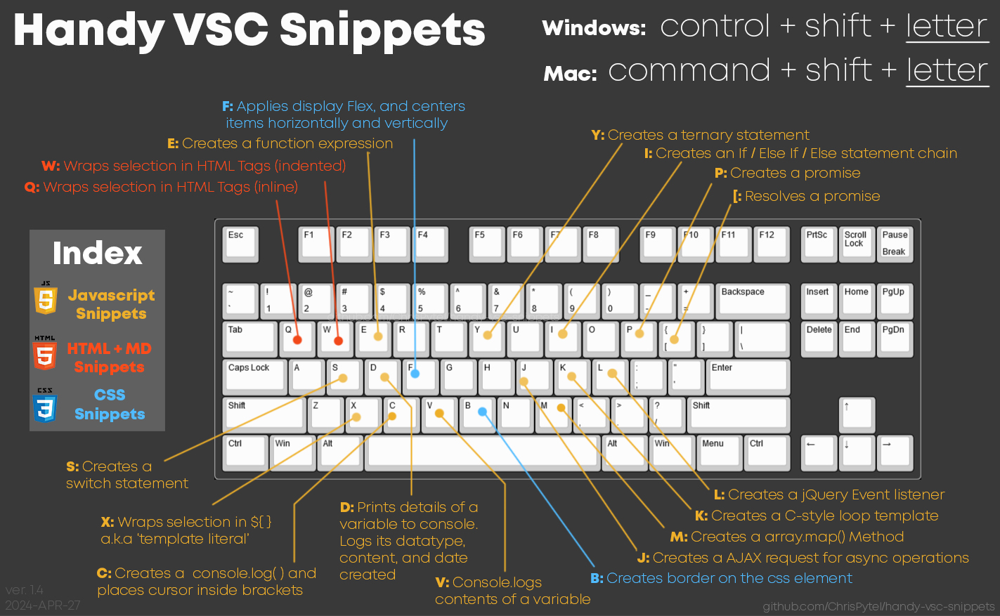

# Handy VSC Snippets ⌨️ 
A handful of useful Visual Studio Code `(VSC)` scripts to make your coding faster. Features 20+ useful expressions and lines of logic that we've gotten familiar with.

Hopefully this will be useful for everyone on their midterm project and final project to save on some of that ever precious time that we dont have enough of.

Consider leaving a Star on the Repo if you found this library useful 😊
  

# Installation
Adding this scripting functionality to your VSC is quite simple. No need for any terminal commands for this. 

1. Go to https://raw.githubusercontent.com/ChrisPytel/handy-vsc-snippets/main/keybindings.json

2. Select all of the script text and copy it to your clipboard. <i>(Control + A and Control + C)</i>

3. Open your VSC go to your command bar and type:  `>Preferences: Open Keyboard Shortcuts (JSON)`

4. Click the dropdown option that says `Preferences: Open Keyboard Shortcuts (JSON)`.  Don't accidentally open `Preferences: Open Default Keyboard Shortcuts (JSON)` and modify its contents. <i>(You won't have a good time.)</i>

5. Paste what we had copied earlier in the clipboard into your local keybindings.json file and save it.

6. <b>Installation complete.</b> Go and try out some scripts!
 

<i>You can customize which buttons they are assigned to in your `keybindings.json` file by changing what the "key" value is defined as.</i>
  

# List of scripts in this library
 Fullscreen the image below to see the complete Shortcut Map
  

Many snippets function best by pressing `tab` to go to the next highlighted parameter.

### JavaScript Snippets

  1. Creates an empty console.log and places cursor inside brackets 
   `Control + Shift + C`
  2. Creates a console.log( ) for quickly checking a variables contents
   `Control + Shift + V`
  3. Creates a detailed console.log( ) for detailed logging of variable datatype
   `Control + Shift + D`
  4. Wraps selection in ${ } a.k.a 'template literal'
   `Control + Shift + X`
  5. Creates a template for an object literal
   `Control + Shift + O`
  6. Creates a template for a function expression
   `Control + Shift + E`
  7. Creates a C-style loop template
   `Control + Shift + K`

  8. Creates an if / else if / else statement chain
   `Control + Shift + I`
  9. Inserts a quick ternary operation
   `Control + Shift + Y`
  10. Creates a template for a switch statement
   `Control + Shift + S`
  11. Creates a template for an array.map() method
   `Control + Shift + M`
  12. Creates a template for module import statement
   `Control + Shift + R`
  --------async js---------
  13. Creates a new promise
   `Control + Shift + P`
  14. Template for resolving a promise
   `Control + Shift + [`
  15. Creates a template for a jQuery event listener
   `Control + Shift + L`
  16. Creates a template for an AJAX request
   `Control + Shift + J`
  18. Creates a template for a pg pool.query() method <b>*coming soon*</b>
  15. Creates a template for a try-catch block <b>*coming soon*</b>

### HTML / Markdown Snippets
  1. Wraps selection in HTML tags (inline)
   `Control + Shift + Q`
  2. Wraps selection in HTML tags (indented)
   `Control + Shift + W`

### CSS Snippets
  1. Creates a dashed border on the css element (you specify the color)
   `Control + Shift + B`
  2. Flexbox container element centering
   `Control + Shift + F`

   
### Secret bonus shortcuts
----------------------------------------
Since you made it to the bottom, heres some extra shortcuts that are built into VSC by default:

<b>In any .js file</b> 
Type `sett` and press tab   = Generates a template for the setTimeout async operation 
Type `fore` and press tab   = Generates a template .forEach() array method 
Type `fori` and press tab   = Generates a template for...in loop  (useful when iterating through objects) 
Type `foro` and press tab   = Generates a template for...of loop  (useful when iterating through arrays) 